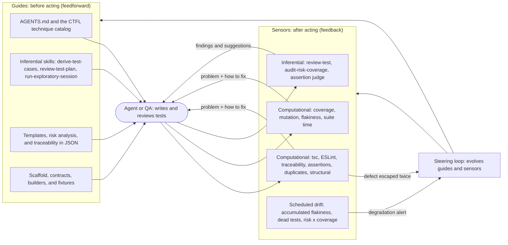
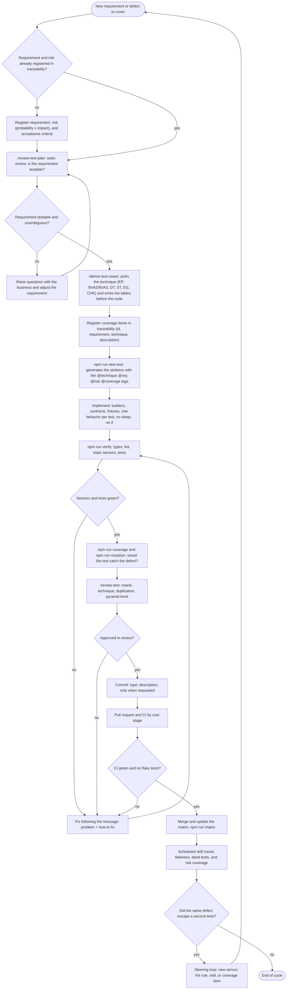

# harness-qa

A quality harness for test automation with **Playwright + TypeScript**. It combines the *Harness Engineering* model (guides that steer beforehand, sensors that measure afterward) with the techniques and vocabulary of the **ISTQB CTFL v4.0** syllabus.

There is no system under test yet. `src/example`, `tests/component/example`, and `docs/traceability/example.json` form a fictional, disposable example: delete them once the real SUT is wired up.

## Core idea

Every test is born from a formal technique (partition, boundary value, decision table, state transition...) and stays traceable to the requirement and the risk:

```
requirement → risk → technique → coverage item → test case → run
```

A test with no technique, no traceability, or no real assertion is blocked by automated sensors, and every message also states **how to fix it**, so an agent (or a person) can act on it alone.

## Architecture

The harness has two directions of control, each with two types of execution:

| | Computational (deterministic) | Inferential (LLM/human) |
|---|---|---|
| **Guides** (before) | scaffold, contracts, builders, `EnvironmentProvider`, tsconfig/ESLint | `AGENTS.md`, skills, templates, technique catalog |
| **Sensors** (after) | lint, types, custom sensors, coverage, mutation, flakiness, drift | `/review-test`, `/review-test-plan`, assertion judge |

Controls act across three dimensions: test suite maintainability, architectural fitness of the automation, and behavior of the system under test (the weakest one: the spec is the guide and the suite is the sensor).

### Architecture flowchart

Whoever acts (an agent or a QA) gets guidance from the guides before acting and is measured by the sensors afterward. Every sensor message states the problem and how to fix it, so the agent closes the loop on its own. When the same defect escapes twice, the steering loop changes the harness itself.



### Flowchart of when each control runs

```mermaid
flowchart LR
    A["Writing the test"] --> B["Pre-commit: tsc, ESLint, static sensors"]
    B -- "failed" --> A
    B --> C["commit-msg: type: description"]
    C -- "off pattern" --> A
    C --> D["Pre-push: statement/branch coverage + report sensors"]
    D -- "failed" --> A
    D --> E["CI stage 1: static"]
    E --> F["CI stage 2: component + coverage"]
    F --> G["CI stage 3: mutation, PR only"]
    G --> H["CI stage 4: contract and integration"]
    H --> I["CI stage 5: E2E and accessibility, main only, regression by risk"]
    I --> J["Scheduled drift sensors"]
    J -- "degradation" --> K["Open an automation defect and revise the harness"]
```



### Flowchart of building a test, start to finish



### Directory structure

```
harness/
  config/           policy.json (techniques, levels, budgets) and stryker.config.json
  guides/skills/    inferential skills (also available under .claude/skills)
  guides/scaffold/  test skeleton generator (npm run new-test)
  sensors/          computational sensors and lib/ (AST, report, policy)
  sensors/inferential/  LLM-as-judge rubric
  loop/             steering loop (what to do when the same defect escapes twice)
tests/              one directory per level: component, contract, integration, e2e,
                    accessibility, performance (k6), exploratory
support/            contracts (small interfaces), environment, builders, clients, page-objects
src/example/        disposable example code
docs/               strategy, risk analysis, templates, traceability, plans, charters
.githooks/          commit-msg, pre-commit, pre-push
.github/workflows/  CI pipeline by cost stage
```

### Dependency rules

- `tests` depend on contracts in `support/contracts`, never on a concrete driver, URL, or credential (DIP). The implementation is injected via a fixture.
- Page objects contain no assertions. Builders know nothing about transport. Contracts have at most 7 members and no implementation.
- `src` never imports from `tests` or `support`.
- Specs don't import other specs and have no mutable module-level state.

The `structural` sensor (rules E1 through E8) checks this automatically.

## Computational sensors

| Sensor | What it detects |
|---|---|
| `traceability` | a test missing `@technique`, `@req`, `@risk`, or `@coverage`; a plan coverage item with no test; inconsistency between test, item, and requirement |
| `assertions` | a test with no `expect`, a trivial assertion or only weak matchers, `if`/loop in the test, a fixed wait, more than 3 assertions |
| `duplicates` | tests with an identical body |
| `structural` | layer violations, literal URL, `process.env` in a test, secret in a literal, global state |
| `flakiness` and `suite-time` | tests that only pass on retry and suites over the per-level budget |
| `drift` | accumulated flakiness, dead or always-skipped tests, requirement coverage by risk level, outdated dependencies |
| `commit-message` | a commit off the `<type>: <up to 4 words>` pattern |

## Test metadata

```ts
test('rejects 11 (above the upper boundary)', {
  tag: ['@technique:BVA3', '@req:REQ-EX-001', '@risk:R-EX-001', '@coverage:EX-BV-11'],
}, () => {
  expect(isQuantityValid(11)).toBe(false);
});
```

Accepted techniques (codes in `harness/config/policy.json`): `EP`, `BVA2`, `BVA3`, `DT`, `ST`, `STMT`, `BRANCH`, `EG`, `CHK`, `ATDD`, `EXPL`. Requirements, risks, and coverage items live in `docs/traceability/*.json`.

## When each control runs

| Moment | Controls |
|---|---|
| Pre-commit | tsc, ESLint, static sensors |
| Commit | message validation |
| Pre-push | statement/branch coverage (component exit criterion, not a target) and report sensors |
| CI (by cost) | static, component, mutation (PR only), contract and integration, E2E and accessibility (main only, regression selected by risk) |
| Scheduled | `drift`, outside the change cycle |

## How to use it

```bash
npm install                 # install dependencies and enable the hooks
npm run verify              # typecheck + lint + static sensors + component tests
npm run coverage             # statements and branches (c8)
npm run mutation              # mutation testing (Stryker)
npm run matrix               # generate docs/traceability/MATRIX.md
npm run new-test -- <level> <name> <TECHNIQUE> <REQ> <RISK> <ITEM>
```

Flow for a new test: register the requirement and risk, run the `/derive-test-cases` skill (the tables come before the code), register the coverage items, generate the skeleton, implement it, and validate with `npm run verify`.

Commits follow Conventional Commits, e.g. `test: Login scenarios`. Secrets come only from environment variables (see `.env.example`).

## Where to read more

- [AGENTS.md](AGENTS.md): conventions, technique catalog, and code rules
- [docs/test-strategy.md](docs/test-strategy.md): principles, levels, entry/exit criteria, open decisions
- [docs/risk-analysis.md](docs/risk-analysis.md): probability x impact matrix
- [docs/control-map.md](docs/control-map.md): table of every control
- [docs/harness-limits.md](docs/harness-limits.md): what still requires human review or exploratory testing
- [docs/roadmap.md](docs/roadmap.md): what to implement in week 1, month 1, and the quarter
- [harness/loop/steering-loop.md](harness/loop/steering-loop.md): how to evolve the harness when a defect escapes twice
