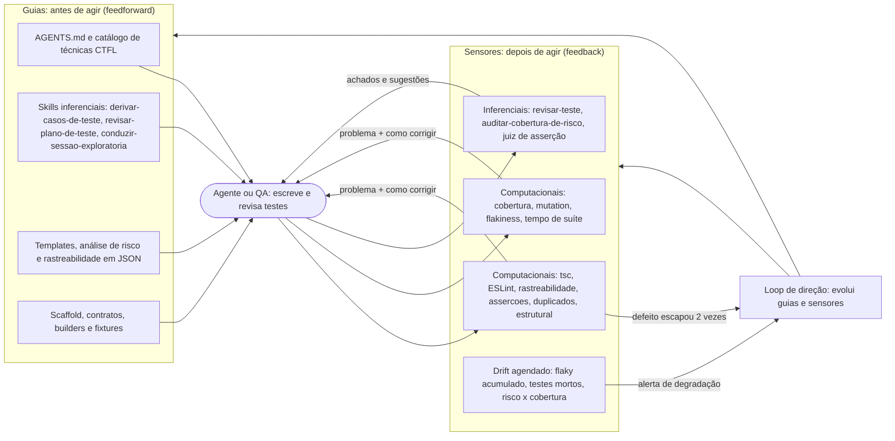
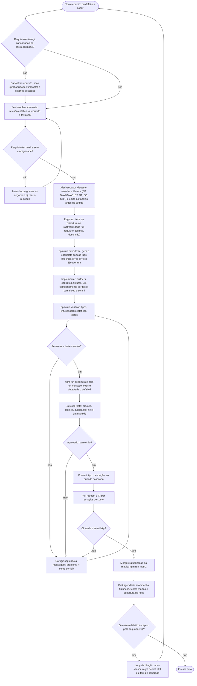

# harness-qa

Harness de qualidade para automação de testes com **Playwright + TypeScript**. Ele combina o modelo de *Harness Engineering* (guias que orientam antes, sensores que medem depois) com as técnicas e o vocabulário do syllabus **ISTQB CTFL v4.0**.

Ainda não há sistema sob teste. `src/exemplo`, `tests/componente/exemplo` e `docs/rastreabilidade/exemplo.json` formam um exemplo fictício e descartável: apague-os ao ligar o SUT real.

## Ideia central

Todo teste nasce de uma técnica formal (partição, valor limite, tabela de decisão, transição de estado...) e fica rastreável até o requisito e o risco:

```
requisito → risco → técnica → item de cobertura → caso de teste → execução
```

Um teste sem técnica, sem rastreio ou sem asserção real é barrado por sensores automáticos, e cada mensagem diz também **como corrigir**, para que um agente (ou pessoa) consiga agir sozinho.

## Arquitetura

O harness tem dois sentidos de controle, cada um com dois tipos de execução:

| | Computacional (determinístico) | Inferencial (LLM/humano) |
|---|---|---|
| **Guias** (antes) | scaffold, contratos, builders, `ProvedorDeAmbiente`, tsconfig/ESLint | `AGENTS.md`, skills, templates, catálogo de técnicas |
| **Sensores** (depois) | lint, tipos, sensores próprios, cobertura, mutation, flakiness, drift | `/revisar-teste`, `/revisar-plano-de-teste`, juiz de asserção |

Os controles atuam em três dimensões: manutenibilidade da suíte, fitness arquitetural da automação e comportamento do sistema sob teste (a mais fraca: a especificação é o guia e a suíte é o sensor).

### Fluxograma da arquitetura

Quem atua (agente ou QA) recebe orientação dos guias antes de agir e é medido pelos sensores depois. Toda mensagem de sensor diz o problema e como corrigir, então o agente fecha o ciclo sozinho. Quando o mesmo defeito escapa duas vezes, o loop de direção muda o próprio harness.



### Fluxograma de quando cada controle roda

```mermaid
flowchart LR
    A["Escrita do teste"] --> B["Pré-commit: tsc, ESLint, sensores estáticos"]
    B -- "falhou" --> A
    B --> C["commit-msg: tipo: descrição"]
    C -- "fora do padrão" --> A
    C --> D["Pré-push: cobertura de comandos e ramos + sensores de relatório"]
    D -- "falhou" --> A
    D --> E["CI estágio 1: estático"]
    E --> F["CI estágio 2: componente + cobertura"]
    F --> G["CI estágio 3: mutation, só em PR"]
    G --> H["CI estágio 4: contrato e integração"]
    H --> I["CI estágio 5: E2E e acessibilidade, só em main, regressão por risco"]
    I --> J["Sensores de drift agendados"]
    J -- "degradação" --> K["Abrir defeito de automação e revisar o harness"]
```



### Fluxograma da criação de um teste, do início ao fim



### Estrutura de diretórios

```
harness/
  config/           politica.json (técnicas, níveis, orçamentos) e stryker.config.json
  guias/skills/     skills inferenciais (também acessíveis em .claude/skills)
  guias/scaffold/   gerador de esqueleto de teste (npm run novo-teste)
  sensores/         sensores computacionais e lib/ (AST, relatório, política)
  sensores/inferenciais/  rubrica do LLM-as-judge
  loop/             loop de direção (o que fazer quando o mesmo defeito escapa duas vezes)
tests/              um diretório por nível: componente, contrato, integracao, e2e,
                    acessibilidade, performance (k6), exploratorio
support/            contratos (interfaces pequenas), ambiente, builders, clients, page-objects
src/exemplo/        código de exemplo descartável
docs/               estratégia, análise de risco, templates, rastreabilidade, planos, charters
.githooks/          commit-msg, pre-commit, pre-push
.github/workflows/  pipeline de CI por estágios de custo
```

### Regras de dependência

- `tests` depende de contratos em `support/contratos`, nunca de driver, URL ou credencial concretos (DIP). A implementação entra por fixture.
- Page objects não contêm asserção. Builders não conhecem transporte. Contratos têm no máximo 7 membros e nenhuma implementação.
- `src` nunca importa de `tests` nem de `support`.
- Specs não importam outros specs e não têm estado mutável de módulo.

O sensor `estrutural` (regras E1 a E8) verifica isso automaticamente.

## Sensores computacionais

| Sensor | O que detecta |
|---|---|
| `rastreabilidade` | teste sem `@tecnica`, `@req`, `@risco` ou `@cobertura`; item de cobertura do plano sem teste; inconsistência entre teste, item e requisito |
| `assercoes` | teste sem `expect`, asserção trivial ou só com matchers fracos, `if`/laço no teste, espera fixa, mais de 3 asserções |
| `duplicados` | testes com corpo idêntico |
| `estrutural` | violações de camada, URL literal, `process.env` em teste, segredo em literal, estado global |
| `flakiness` e `tempo-de-suite` | testes que só passam com retry e suítes acima do orçamento por nível |
| `drift` | flakiness acumulada, testes mortos ou sempre ignorados, cobertura de requisitos por nível de risco, dependências desatualizadas |
| `mensagem-de-commit` | commit fora do padrão `<tipo>: <até 4 palavras>` |

## Metadado de teste

```ts
test('rejeita 11 (acima do limite superior)', {
  tag: ['@tecnica:BVA3', '@req:REQ-EX-001', '@risco:R-EX-001', '@cobertura:EX-BV-11'],
}, () => {
  expect(quantidadeEhValida(11)).toBe(false);
});
```

Técnicas aceitas (códigos em `harness/config/politica.json`): `EP`, `BVA2`, `BVA3`, `DT`, `ST`, `STMT`, `BRANCH`, `EG`, `CHK`, `ATDD`, `EXPL`. Requisitos, riscos e itens de cobertura vivem em `docs/rastreabilidade/*.json`.

## Quando cada controle roda

| Momento | Controles |
|---|---|
| Pré-commit | tsc, ESLint, sensores estáticos |
| Commit | validação da mensagem |
| Pré-push | cobertura de comandos e ramos (critério de saída de componente, não meta) e sensores de relatório |
| CI (por custo) | estático, componente, mutation (só em PR), contrato e integração, E2E e acessibilidade (só em main, regressão selecionada por risco) |
| Agendado | `drift`, fora do ciclo da mudança |

## Como usar

```bash
npm install                 # instala dependências e ativa os hooks
npm run verificar           # typecheck + lint + sensores estáticos + testes de componente
npm run cobertura           # comandos e ramos (c8)
npm run mutacao             # mutation testing (Stryker)
npm run matriz              # gera docs/rastreabilidade/MATRIZ.md
npm run novo-teste -- <nivel> <nome> <TECNICA> <REQ> <RISCO> <ITEM>
```

Fluxo para um teste novo: cadastre requisito e risco, rode a skill `/derivar-casos-de-teste` (as tabelas vêm antes do código), registre os itens de cobertura, gere o esqueleto, implemente e valide com `npm run verificar`.

Commits seguem Conventional Commits, por exemplo `test: Cenários de login`. Segredos vêm só de variáveis de ambiente (veja `.env.example`).

## Onde ler mais

- [AGENTS.md](AGENTS.md): convenções, catálogo de técnicas e regras de código
- [docs/estrategia-de-testes.md](docs/estrategia-de-testes.md): princípios, níveis, critérios de entrada e saída, decisões em aberto
- [docs/analise-de-risco.md](docs/analise-de-risco.md): matriz probabilidade x impacto
- [docs/mapa-de-controles.md](docs/mapa-de-controles.md): tabela de todos os controles
- [docs/limites-do-harness.md](docs/limites-do-harness.md): o que exige revisão humana ou teste exploratório
- [docs/roadmap.md](docs/roadmap.md): o que implementar na semana 1, no mês 1 e no trimestre
- [harness/loop/loop-de-direcao.md](harness/loop/loop-de-direcao.md): como evoluir o harness quando um defeito escapa duas vezes
